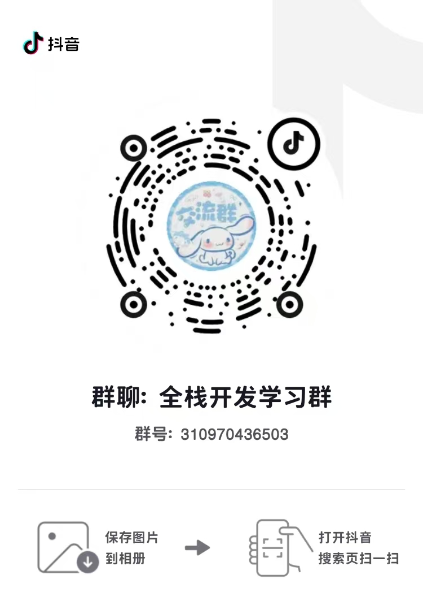

  

<h1 align="center">Study for the Future</h1>

<em>从零到全栈 · 学生写给学生的实战路线</em>

  
  
  

---

##   关于本仓库

这是一份专为刚考完试、希望利用碎片时间提升能力的同学准备的学习路线。覆盖从计算机基础、前端、后端到工程化与实战的完整成长路径，结构清晰、持续更新。

**亮点**

- 学生视角：内容贴近真实学习过程，不刻意拔高
- 路线完整：从基础到实战，层层递进
- 持续更新：每个专题都在完善，欢迎建议与贡献

---

##   目录

- [写给考完试的你](#写给考完试的你)
- [学习路线](#学习路线)
  - [地基篇](#地基篇)
  - [前端篇](#前端篇)
  - [后端篇](#后端篇)
  - [工程化篇](#工程化篇)
  - [实战进阶篇](#实战进阶篇)
- [技术栈](#技术栈)
- [加入交流群](#加入交流群)
- [贡献指南](#贡献指南)

---

##   写给考完试的你

> 考试结束了，突然空下来，不知道该干什么？刷了两天手机，看了几个教程，还是感觉什么都不会？
>
> **我也是学生。我经历过完全一样的状态。**
>
> 这里不是一个培训机构的教学大纲 —— 这是一份**学生写给学生的、真正从零开始的**全栈学习路线。
>
> 每个专题有详细内容，仓库持续更新。把考后的空闲时间，变成未来的竞争力。

---

##   学习路线

###   地基篇

| # | 专题 | 涵盖内容 |
|:---:|------|------|
| 1 | 计算机网络基础 | HTTP/HTTPS、TCP/IP、DNS、请求与响应 |
| 2 | Linux 基础 | 命令行、文件系统、权限管理、Shell 脚本 |
| 3 | VSCode等工具设置 | 设置优化，插件推荐 |

###   前端篇

| # | 专题 | 涵盖内容 |
|:---:|------|------|
| 4 | HTML & CSS | 语义化、Flex/Grid、响应式布局、动画 |
| 5 | JavaScript 核心 | 闭包/原型、异步编程、Promise、ES6+ |
| 6 | DOM & 浏览器 | DOM 操作、事件循环、渲染原理 |

###   后端篇

| # | 专题 | 涵盖内容 |
|:---:|------|------|
| 7 | Node.js / Python | RESTful API、路由、中间件 |
| 8 | 数据库 | MySQL、MongoDB、SQL、索引 |
| 9 | 认证与安全 | JWT、CORS、XSS/CSRF 防护 |

###   工程化篇

| # | 专题 | 涵盖内容 |
|:---:|------|------|
| 10 | Git 版本控制 | 分支管理、合并冲突、PR 流程 |
| 11 | 前端工程化 | Webpack/Vite、ESLint、组件化 |
| 12 | Docker | 镜像构建、容器运行、Docker Compose |

###   实战进阶篇

| # | 专题 | 涵盖内容 |
|:---:|------|------|
| 13 | React / Vue | 状态管理、路由、Hooks、SSR |
| 14 | 全栈项目实战 | 前端 → 后端 → 数据库，完整落地 |
| 15 | 部署运维 | Nginx、HTTPS、CI/CD、云服务器 |

---

##   技术栈

**前端**

  
  
  
  
  

**后端 & 语言**

  
  
  
  

**数据库 & 工具**

  
  
  
  
  

---

##   加入交流群

  <table>
    <tr>
      <td align="center">
        
      </td>
      <td width="40"></td>
      <td align="center">
        
      </td>
    </tr>
  </table>
  
扫描二维码或点击链接加入学习交流群

  

    
    
  

---

##   贡献指南

欢迎你成为这个仓库的贡献者！

- 发现需要补充的内容可以提 Issue
- 有更好的学习路线或资源可以提交 PR
- 感谢每一位愿意一起改进的同学

---

  Made with love by a student, for students. © 2026

