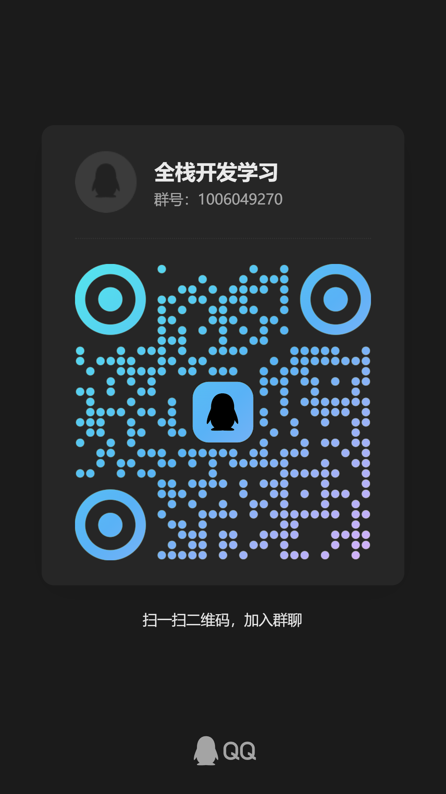

  <h1>📚 Study for the Future</h1>
  
<em>从零到全栈 · 学生写给学生的实战路线</em>

  
🚀 把考后的空闲时间，变成未来的竞争力

 

  
  
  

 

---

  <h2>📖 目录</h2>

- [写给考完试的你](#intro)
- [🗺️ 学习路线](#roadmap)
  - [📡 地基篇](#foundation)
  - [🎨 前端篇](#frontend)
  - [⚙️ 后端篇](#backend)
  - [🔧 工程化篇](#engineering)
  - [🚀 实战进阶篇](#advanced)
- [📖 学习网站推荐](#recommendations)
  - [Java 全栈体系](#java-full-stack)
  - [后端面试体系](#backend-interview)
  - [图解计算机基础](#computer-basics)
- [🛠️ 技术栈](#tech-stack)
- [💬 加入交流群](#community)
- [🤝 贡献指南](#contributing)

---

  <h2 id="intro">📖 写给考完试的你</h2>

> 考试结束了，突然空下来，不知道该干什么？刷了两天手机，看了几个教程，还是感觉什么都不会？
>
> **我也是学生。我经历过完全一样的状态。**
>
> 这里不是一个培训机构的教学大纲 —— 这是一份**学生写给学生的、真正从零开始的**全栈学习路线。
>
> 每个专题有详细内容，仓库持续更新。把考后的空闲时间，变成未来的竞争力。

 

---

  <h2 id="roadmap">🗺️ 学习路线</h2>
  
<em>从地基到全栈，没有跳跃，每一步都扎实。</em>

 

  <h3 id="foundation">📡 地基篇</h3>

| # | 专题 | 涵盖内容 |
|:---:|------|------|
| 1 | 🔢 **计算机网络基础** | `HTTP/HTTPS` `TCP/IP` `DNS` `请求与响应` |
| 2 | 🐧 **Linux 基础** | `命令行` `文件系统` `权限管理` `Shell 脚本` |
| 3 | 💻 **计算机组成原理** | `CPU/内存/IO` `程序运行原理` |

 

  <h3 id="frontend">🎨 前端篇</h3>

| # | 专题 | 涵盖内容 |
|:---:|------|------|
| 4 | 📄 **HTML & CSS** | `语义化` `Flex/Grid` `响应式` `动画` |
| 5 | 🟨 **JavaScript 核心** | `闭包/原型` `异步` `Promise` `ES6+` |
| 6 | 🌐 **DOM & 浏览器** | `DOM 操作` `事件循环` `渲染原理` |

 

  <h3 id="backend">⚙️ 后端篇</h3>

| # | 专题 | 涵盖内容 |
|:---:|------|------|
| 7 | 🟢 **Node.js / Python** | `RESTful API` `路由` `中间件` |
| 8 | 🗄️ **数据库** | `MySQL` `MongoDB` `SQL` `索引` |
| 9 | 🔐 **认证与安全** | `JWT` `CORS` `XSS/CSRF 防护` |

 

  <h3 id="engineering">🔧 工程化篇</h3>

| # | 专题 | 涵盖内容 |
|:---:|------|------|
| 10 | 📦 **Git 版本控制** | `分支管理` `合并冲突` `PR 流程` |
| 11 | 🏗️ **前端工程化** | `Webpack/Vite` `ESLint` `组件化` |
| 12 | 🐳 **Docker** | `镜像构建` `容器运行` `Docker Compose` |

 

  <h3 id="advanced">🚀 实战进阶篇</h3>

| # | 专题 | 涵盖内容 |
|:---:|------|------|
| 13 | ⚛️ **React / Vue** | `状态管理` `路由` `Hooks` `SSR` |
| 14 | 🏆 **全栈项目实战** | `前端 → 后端 → 数据库，完整落地` |
| 15 | ☁️ **部署运维** | `Nginx` `HTTPS` `CI/CD` `云服务器` |

 

---

 

  <h2 id="recommendations"> 学习网站推荐</h2>
  
<em>先用系统化资料建立知识框架，再用项目和题目反复验证。</em>

 

<!-- ☕ Java 全栈体系 -->

  <table width="90%">
    <tr>
      <td align="center" style="padding: 8px 24px;">
        <h3 id="java-full-stack">☕ Java 全栈体系</h3>
        

        
<b><a href="https://pdai.tech/">🔗 pdai.tech</a></b>

        
📚 Java 基础 · ⚙️ JVM · 🌱 Spring · 🗄️ 数据库 · 🔗 分布式 · 🐳 Docker · 🐧 Linux 与 DevOps

      </td>
    </tr>
  </table>

 

<!-- 📝 后端面试体系 -->

  <table width="90%">
    <tr>
      <td align="center" style="padding: 8px 24px;">
        <h3 id="backend-interview">📝 后端面试体系</h3>
        

        
<b><a href="https://javaguide.cn/">🔗 JavaGuide</a></b>

        
☕ Java · 📦 集合 · 🔄 并发 · ⚙️ JVM · 🗄️ MySQL · ⚡ Redis · 🌐 分布式 · 🏗️ 系统设计

      </td>
    </tr>
  </table>

 

<!-- 🖥️ 图解计算机基础 -->

  <table width="90%">
    <tr>
      <td align="center" style="padding: 8px 24px;">
        <h3 id="computer-basics">🖥️ 图解计算机基础</h3>
        

        
<b><a href="https://www.xiaolincoding.com/">🔗 小林 coding</a></b>

        
🌐 图解网络 · 💻 操作系统 · 🗄️ MySQL · ⚡ Redis · 🎯 后端高频面试题

      </td>
    </tr>
  </table>

 

---

  <h2 id="tech-stack">🛠️ 技术栈</h2>

**🎨 前端**
 

  &nbsp;
  &nbsp;
  &nbsp;
  &nbsp;
  

**⚙️ 后端 & 语言**
 

  &nbsp;
  &nbsp;
  &nbsp;
  

**🗄️ 数据库 & 工具**
 

  &nbsp;
  &nbsp;
  &nbsp;
  &nbsp;
  

 

---

  <h2 id="community">💬 加入交流群</h2>

  
<em>一个人可以走得很快，但一群人才能走得更远。</em>

  <table>
    <tr>
      <td align="center">
        
          
        
          
        📱 扫码或点击上方按钮加入
      </td>
    </tr>
  </table>

 

---

  <h2 id="contributing">🤝 贡献指南</h2>

> 💡 这个项目属于每一个想改变自己的同学。
>
> 发现错误？有更好的想法？欢迎提 **Issue** 或 **Pull Request**！
>
> 让我们一起把这份路线打磨得更好 ✨

 

---

  
   
  Made with ❤️ by a student, for students. © 2026

